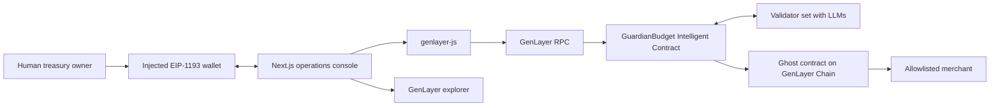

# Architecture And Flows

This document describes the implemented GenLayer architecture. The Intelligent
Contract passes the GenVM linter, validator, and a 79-case direct-mode test
suite. It is deployed on **Studionet** (chain 61999) and verified end to end;
see the root README for exact status.

## Architecture



There is no application server and no database. The contract holds the
requests, the decisions, and the funds; the frontend is a view over
`get_config`, `get_requests`, and `get_request`.

Trust boundaries:

- The owner controls policy, pause, withdrawals, ownership, and agent rotation.
- The validator set supplies contextual judgment. No validator holds a key to
  the treasury, and a validator verdict cannot override contract policy.
- The authorized agent may execute already-approved requests, but only after the
  merchant of record has confirmed delivery of a verifiable deliverable.
  Compromise is bounded by the delivery condition, the per-transaction limit,
  the hourly window, the allowlist, and the pause switch — bounded, not made
  harmless.
- The contract is authoritative for treasury balance and enforceable policy.
- Merchant-supplied `purpose` and `evidence`, and LLM output, are untrusted.
  Evidence must anchor the purchase to an independently verifiable artifact to
  qualify for autonomous approval.

## Adjudication Flow

`submit_request` is a single transaction that validates input, asks the
validator set for a judgment, and then applies deterministic policy on top of
the answer.

1. Validate the request ID shape and uniqueness, the merchant address, a
   nonzero `u256` amount, text length and control characters, and an expiry
   between 30 seconds and 7 days out.
2. Snapshot the policy facts the contract can assert itself: allowlist status,
   per-transaction limit, remaining hourly budget, treasury balance, and
   whether an equivalent unsettled request already exists.
3. Build the prompt. Trusted facts are supplied as a separate JSON block,
   including whether the evidence references a verifiable artifact. Merchant
   text is fenced and explicitly demoted to inert data, with an instruction that
   instruction-like content is itself grounds for `manual_review`.
4. The leader calls its model with `response_format="json"`. The reply is
   coerced into a fixed schema — `decision`, `risk_score`, `confidence`,
   `expected_value`, `reasoning` — or the transaction fails. Unparseable
   output is never defaulted into an approval.
5. Each validator independently asks its own model the same question. The
   `decision` must match exactly; `risk_score` must fall within 20 points; and
   `confidence` — the value that gates autonomous approval against the 75%
   floor — must fall within 15 points. Validators never accept the leader's
   answer on the strength of its shape alone. Disagreement rotates the leader;
   persistent disagreement leaves the transaction undetermined and the state
   unchanged.
6. Consensus reached, the contract applies its own overrides. A deterministic
   rejection reason (unallowlisted merchant, duplicate, over any limit,
   insufficient balance) demotes the decision to `reject` and records
   `POLICY_OVERRIDE`. An `approve` below 75 confidence becomes `manual_review`,
   and so does an `approve` whose evidence is narrative-only, because
   requester-supplied text alone cannot substantiate a purchase.
7. The record is written with the resulting status and the decision provenance.

## Enforcement Flow

`execute_payment` re-checks everything against live state, because an approval
is a judgment at a point in time and not a standing permission.

```python
execute_payment(request_id)
finalize_payment(request_id, settlement_reference)
resolve_pending_payment(request_id)
```

Checked again at authorization: caller is the agent or the owner, treasury is not
paused, the request is in `APPROVED`, the request has not expired, the merchant
is still allowlisted, the amount is still within the per-transaction limit, the
hourly window still has room, and the treasury balance covers the amount plus
everything already in flight (`pending_total`). When the caller is the agent,
the merchant of record must already have confirmed delivery.

Authorization is not payment. `execute_payment` reserves the hourly-window debit
and the in-flight value, moves the record to `PAYMENT_PENDING`, and emits the
transfer. Because the transfer is an external message to the chain layer, it
settles on finalization; until then the request is never reported as `PAID`.
`PAYMENT_PENDING` cannot be turned into `PAID` by assertion: `finalize_payment`
is permissionless but trusts no caller — the validators fetch the transfer's
receipt from `settlement_verifier_url` (a `{tx}` URL template fixed at deploy),
confirm it is `FINALIZED` and references this contract as sender, the merchant as
recipient, and the exact amount, and only then move the record to `PAID` and
record `paidAt`. A receipt that cannot be fetched or does not match refuses
finalization. `resolve_pending_payment`, also permissionless, unwinds a transfer
that never settled and returns the request to `APPROVED`. Expiry during
finalization is non-destructive: an in-flight transfer is honored, it simply
cannot be re-executed.

## Artifact Registry

Autonomous approval requires evidence whose sha256 digest was committed on-chain
by the merchant of record via `commit_artifact`, together with the URL the
artifact is served from. The registry is a public, attributable record: a
requester can type any digest into the evidence, but only the issuing account can
commit it. During adjudication each validator independently fetches that URL,
hashes the contents, and compares the result to the committed digest; the fetched
content is also passed to the model to judge the amount, purpose, and delivery.
`submit_request` asserts those facts and then applies them as deterministic
gates: an `approve` whose digest was not committed by the merchant, or whose
fetched contents did not hash to the digest, is demoted to `MANUAL_REVIEW`. This
is what makes the artifact independently verifiable rather than
requester-asserted.

`review_request` lets the owner overturn the model, not the policy. An
owner-approved request still has to survive every check above, and the agent
still needs the merchant's delivery confirmation.

## User Flow

1. Owner opens the console; `client.connect()` puts the wallet on the
   Studionet, adding it if absent.
2. The UI reads owner, agent, limits, pause state, window state, balance, and
   the request log from the contract.
3. Owner funds the treasury and configures policy through wallet-signed
   transactions.
4. A request is submitted; validators adjudicate it inside the transaction.
5. Owner resolves anything in `MANUAL_REVIEW` with an on-chain reason.
6. The merchant of record commits the deliverable digest and, later, confirms
   delivery, releasing the agent's authority.
7. The agent or the owner authorizes the payment; the request goes
   `PAYMENT_PENDING` while the transfer settles.
8. The owner verifies in the console that the triggered transfer finalized and
   the state reconciles, then finalizes the payment; the request becomes `PAID`.
9. Owner pauses execution, confirms an authorization is refused, then resumes.

## Security And Failure Flows

| Condition | Result |
| --- | --- |
| Wallet on the wrong chain | `client.connect()` switches or adds the network before any write |
| Connected account is not the owner | Owner-only controls are disabled in the UI and rejected by the contract |
| Injected instructions in merchant text | Fenced as data; instruction-like content is grounds for `manual_review`; policy override still applies |
| Narrative-only evidence | `approve` demoted to `MANUAL_REVIEW` by the contract — requester text alone cannot substantiate a purchase |
| Digest not committed by the merchant | `approve` demoted to `MANUAL_REVIEW` — requester-typed markers are not independent verification |
| Conflicting validator confidence | Validator rejects the proposal when its own confidence differs by more than 15 points |
| Malformed LLM output | Transaction fails rather than defaulting; validator disagreement rotates the leader |
| Validators cannot agree | Transaction goes undetermined and contract state is unchanged |
| Model says reject | Recorded on-chain; `execute_payment` refuses a non-approved request |
| Manual review | Requires an explicit owner transaction carrying a reason |
| Duplicate request ID | `submit_request` fails |
| Equivalent unsettled request | Deterministic `POLICY_OVERRIDE` rejection |
| Agent without merchant delivery confirmation | `execute_payment` refuses — an approved narrative alone cannot trigger payment |
| Expired request | `execute_payment` and `review_request` both refuse |
| Expiry during settlement finalization | In-flight `PAYMENT_PENDING` transfer is still finalized; it cannot be re-executed |
| Merchant de-allowlisted after approval | `execute_payment` refuses |
| Limit lowered after approval | `execute_payment` refuses |
| Hourly window exhausted | `execute_payment` refuses; window resets on the hour |
| Unresolved or failed external transfer | `resolve_pending_payment` (permissionless) releases the reservation and returns the request to `APPROVED` |
| Pending payment marked paid from an assertion | `finalize_payment` is permissionless but the validators fetch the transfer receipt and require FINALIZED with matching sender, recipient, and amount before it records `PAID` |
| Artifact contents do not match the committed digest | Validators hash the fetched body; the `approve` is demoted to `MANUAL_REVIEW` |
| Emergency pause | Agent settlement blocked; owner withdrawal and configuration still work |
| Agent key compromise | Delivery condition, limits, allowlist, and pause bound the loss; owner rotates the agent |
| Execution failure after finalization | The UI waits for `FINALIZED`, checks the execution result, and reports failure instead of success |

Security claims require evidence. A passing test suite supports correctness but
is not an audit. No independent audit has been performed.
