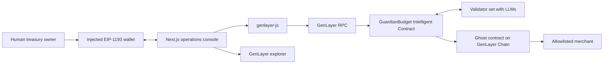

# Architecture And Flows

This document describes the implemented GenLayer architecture. The Intelligent
Contract passes the GenVM linter, validator, and a 60-case direct-mode test
suite. It is deployed on **Studionet** (chain 61999) and verified end to end;
see the root README for exact status.

## Architecture



There is no application server and no database. The contract holds the
requests, the decisions, and the funds; the frontend is a view over
`get_config`, `get_requests`, and `get_request`.

Trust boundaries:

- The owner controls policy, pause, withdrawals, ownership, and agent rotation.
- The validator set supplies contextual judgment. No validator holds a key to
  the treasury, and a validator verdict cannot override contract policy.
- The authorized agent may settle already-approved requests. Compromise is
  bounded by the per-transaction limit, the hourly window, the allowlist, and
  the pause switch — bounded, not made harmless.
- The contract is authoritative for treasury balance and enforceable policy.
- Merchant-supplied `purpose` and `evidence`, and LLM output, are untrusted.

## Adjudication Flow

`submit_request` is a single transaction that validates input, asks the
validator set for a judgment, and then applies deterministic policy on top of
the answer.

1. Validate the request ID shape and uniqueness, the merchant address, a
   nonzero `u256` amount, text length and control characters, and an expiry
   between 30 seconds and 7 days out.
2. Snapshot the policy facts the contract can assert itself: allowlist status,
   per-transaction limit, remaining hourly budget, treasury balance, and
   whether an equivalent unsettled request already exists.
3. Build the prompt. Trusted facts are supplied as a separate JSON block.
   Merchant text is fenced and explicitly demoted to inert data, with an
   instruction that instruction-like content is itself grounds for
   `manual_review`.
4. The leader calls its model with `response_format="json"`. The reply is
   coerced into a fixed schema — `decision`, `risk_score`, `confidence`,
   `expected_value`, `reasoning` — or the transaction fails. Unparseable
   output is never defaulted into an approval.
5. Each validator independently asks its own model the same question. The
   `decision` must match exactly; `risk_score` must fall within 20 points.
   Validators never accept the leader's answer on the strength of its shape
   alone. Disagreement rotates the leader; persistent disagreement leaves the
   transaction undetermined and the state unchanged.
6. Consensus reached, the contract applies its own overrides. A deterministic
   rejection reason (unallowlisted merchant, duplicate, over any limit,
   insufficient balance) demotes the decision to `reject` and records
   `POLICY_OVERRIDE`. An `approve` below 75 confidence becomes
   `manual_review`.
7. The record is written with the resulting status and the decision provenance.

## Enforcement Flow

`execute_payment` re-checks everything against live state, because an approval
is a judgment at a point in time and not a standing permission.

```python
execute_payment(request_id)
```

Checked again at settlement: caller is the agent or the owner, treasury is not
paused, the request is in `APPROVED`, the request has not expired, the merchant
is still allowlisted, the amount is still within the per-transaction limit, the
hourly window still has room, and the treasury balance covers it.

State is committed before value leaves: the record moves to `PAID`, the window
and totals update, and only then is the transfer emitted. Because the transfer
is an external message to the chain layer, it always executes on finalization.

`review_request` lets the owner overturn the model, not the policy. An
owner-approved request still has to survive every check above.

## User Flow

1. Owner opens the console; `client.connect()` puts the wallet on the
   Studionet, adding it if absent.
2. The UI reads owner, agent, limits, pause state, window state, balance, and
   the request log from the contract.
3. Owner funds the treasury and configures policy through wallet-signed
   transactions.
4. A request is submitted; validators adjudicate it inside the transaction.
5. Owner resolves anything in `MANUAL_REVIEW` with an on-chain reason.
6. The agent or the owner settles an approved request and opens the receipt in
   the explorer.
7. Owner pauses execution, confirms a settlement is refused, then resumes.

## Security And Failure Flows

| Condition | Result |
| --- | --- |
| Wallet on the wrong chain | `client.connect()` switches or adds the network before any write |
| Connected account is not the owner | Owner-only controls are disabled in the UI and rejected by the contract |
| Injected instructions in merchant text | Fenced as data; instruction-like content is grounds for `manual_review`; policy override still applies |
| Malformed LLM output | Transaction fails rather than defaulting; validator disagreement rotates the leader |
| Validators cannot agree | Transaction goes undetermined and contract state is unchanged |
| Model says reject | Recorded on-chain; `execute_payment` refuses a non-approved request |
| Manual review | Requires an explicit owner transaction carrying a reason |
| Duplicate request ID | `submit_request` fails |
| Equivalent unsettled request | Deterministic `POLICY_OVERRIDE` rejection |
| Expired request | `execute_payment` and `review_request` both refuse |
| Merchant de-allowlisted after approval | `execute_payment` refuses |
| Limit lowered after approval | `execute_payment` refuses |
| Hourly window exhausted | `execute_payment` refuses; window resets on the hour |
| Emergency pause | Agent settlement blocked; owner withdrawal and configuration still work |
| Agent key compromise | Limits, allowlist, and pause bound the loss; owner rotates the agent |
| Execution failure after consensus | The UI reads `txExecutionResult` and reports failure instead of treating acceptance as success |

Security claims require evidence. A passing test suite supports correctness but
is not an audit. No independent audit has been performed.
